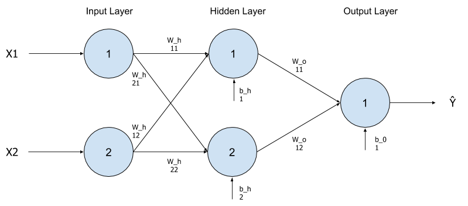

# Multilayer Perceptron (MLP)

A multilayer perceptron (MLP) is a class of feed-forward artificial neural network(NN). A MLP consists of, at least, three layers of nodes: an input layer, a hidden layer and an output layer. Except for the input nodes, each node is a neuron that uses a nonlinear activation function (Wikipedia).

In this repository, I present the mathematical formulation and implementation in Python of a MLP. I also train and validate the algorithm against three different data sets, presenting practical examples of how to use MLP to classify data.

# Preamble 

You may be asking yourself: why do we need another Perceptron/MLP explanation in the internet? This repository provides my thought process after reading several materials when I tried to implement a MLP myself. At the time, I was able to understand and implement it only after a lot of reading, and trial and error. So, as I felt the necessity to be exposed to different ways of explaining the same topic, I think others may face the same situation.

Hope this document can help you on your learning journey. Good Luck !

# Mathematical Formulation

MLPs are composed by mathematical neurons and its synapses, in this case called weights. Neurons are arranged in layers, and connected between them through weights. The simplest MLP you can build is composed of three layers: Input, Hidden and Output layers. In the classical topology each neuron of a given layer is fully connected with the neurons of the next layer. 

## *Perceptron*

Many of the concepts utilized in this articles are explained in the [Perceptron](https://github.com/filipecalasans/percepetron) repository. So, you may want to check it out before continuing to the MLP formulation. Perceptron is the simplest Neural Network composed of a single neuron that helps us to build the theoretical foundation for MLPs. However, if you already have solid understanding of the mathematic concepts used on *Perceptrons*, feel free to skip to the next section.

# Topology 

We'll start formulating a MLP with the topology 2-2-1 as shown in the picture billow, then we'll generalize from this particular case.

The topology is composed of:

* 2 Input Layer Neurons
* 2 Hidden Layer neurons
* 1 Output Layer Neuron 

 <p align="center"> 
    
 </p>

# Formulation

## Notation

We are going to use the following notation across this article:

* : Weight connection between the Neuron number  of the layer  (previous layer) and Neuron number  of the layer  (current layer).
*  neuron bias  of the layer  
* : Component  of the input vector.
* : Component  of the expected output vector.
* : Component  of the estimated output vector.
* : Output of the Neuron  in the layer  before applying the activation function.
* :Output of the neuron  in the layer  after applying the activation function.
* : activation function
## Matrix Notation

* : Weight connection matrix of Layer the .
* : bias vector of the layer . 
* : Input vector
* : Expected output vector. This vector represents a known class.
* : Estimated output vector. This vector represents the computed output of the Neural Network.
* : Neuron Output vector before applying the activation function.
* : Neuron Output vector after applying the activation function.
* : Training Example; The tuple  defines a training example.

Let's write the equations for the particular case: 2-2-1 MLP.

### Hidden Layer

<p align="center"></p>

<p align="center"></p>

<p align="center"></p>

<p align="center"></p>

Matrix notation:

<p align="center"></p>


<p align="center"></p>

Algebric matrix equation:

<p align="center"></p>


<p align="center"></p>

### Output Layer

The same formulation can be applied for the output layer. However,the input will be the previous layer's output .

<p align="center"></p>

<p align="center"></p>

### Generalized Notation

We can generalize the previous formulas to any neural network topology. We can assume that the weight matrix for the input layer is the identity matrix , and the bias matrix is zero. Then, we can use a single equation to represent the output of a given layer L.

<p align="center"></p>

<p align="center"></p>

<p align="center"></p>

# Backpropagation

Backpropagation is the mechanism used to update the weights and bias starting from the output, and propagating through the other layers.

Let's start applying the Stochastic Gradient Descent in the output layer.

<p align="center"></p>

<p align="center"></p>

where,

<p align="center"></p>

Applying the Chain Rule in the derivative, we have:

<p align="center"></p>

<p align="center"></p>

Now, you should remember that , therefore we can apply the chain rule one more time. Then, we have:

<p align="center"></p>

<p align="center"></p>

If you remember from vectorial calculus, you can notice that:

<p align="center"></p>

This is true because the cost function is scalar and the derivative of the Cost Function regarding each component  is by definition the gradient of .

Moreover, we can draw the following simplifications:

<p align="center"></p>

<p align="center"></p>

<p align="center"></p>

<p align="center"></p>

Using algebric matrix notation:

<p align="center"></p>

<p align="center"></p>

Applying the generic formulas above on the output layer, we have:

<p align="center"></p>

<p align="center"></p>

#### *Hadamard Product*

Before we merge the equations into the learning equation (SGD), let me introduce you the *Hadamard Product* operator if you already are not familiar with it. So, we can present the eqaution on a more compact way.

The *Hadamard Product*, symbol , is an operation between two matrices of same dimension, that produces a matrix with the same dimension. The result matrix is the result of the multiplication of elements  of the original matrices. Therefore, it is a element-wise multiplication between two matrices. For example:

<p align="center"></p>

#### Continuing with the mathematical formulation...

<p align="center"></p>

<p align="center"></p>

You might have noticed that the Chain Rule allowed us to write the derivatives above as a function of two terms:

* The first term depends only on the output layer: .
* The second term depends only on the previous layer output: 

Then we can introduce a new term called delta:

<p align="center"></p>

Therefore,

<p align="center"></p>

<p align="center"></p>

Then, we have the following learning equations for the output layer:

<p align="center"></p>

<p align="center"></p>


### Learning Equations Hidden Layer

We are now ready to generalize the equations for any neural network topology. 

Starting from the following derivative, we have:

<p align="center"></p>

Wan calculate the total cost in terms of the contribution of each neuron in the hidden layer. So, you can think that each neuron in the hidden layer contributes partially to each one of the output neurons. This relation can be expressed as: 

<p align="center"></p>

<p align="center"></p>


<p align="center"></p>

Applying chain rule inside the sum we have:


<p align="center"></p>


Remember that:

<p align="center"></p>

The following equation represents the change rate of each of the weights connecting a hidden neuron to a output neuron 
<p align="center"></p>

Then we have:

<p align="center"></p>

Notice that the term:

<p align="center"></p>

Therefore, we can say that updating the weights of a given layer always yields to:


<p align="center"></p>

<p align="center"></p>

Algorithmically speaking, we should execute the following steps:

1. Calculate the NN output for the current weights configuration.
2. Calculate the prediction error using the output and the test example.
3. Starting from the last hidden layer calculate the deltas iteratively.
4. Apply the Learning Equations and update the weights and biases.
5. Repeat until the NN converges

# Python Code explained

The segmented the implementation in three different functions:

1. Calculate the NN output for the current weights configuration.
   
```python
   def update_neuron_outputs(self, x):
      
      self.a[0] = x

      for layer, w_i in enumerate(self.w):
         
         # self.w doesn't consider the input layer, so add 1.
         # We want to update the neuron ouput of the layer(l),
         # so we calculate the activation output using inputs from (l-1) layer
         # and beta from the lth layer.
         output_index = layer + 1
        
         # print("layer: {}, dim(wi): {}, dim(a): {}, dim(beta): {}".format(layer, w_i.shape, self.a[layer].shape, self.beta[layer].shape))

         # *** beta is indexed as W - we do not consider the
         # input layer weights (Indentity Matrix) neither the beta
         # from the input layer.
         z = np.matmul(w_i, self.a[layer]) + self.beta[layer] 
         
         # apply activation function (default is sigmoide)  
         self.a[output_index] = self.apply_activation_function(z)
         self.d_a[output_index] = self.apply_d_activation_function(z)
```

2. Calculate the prediction error using the output and the test example.
   
   Note: `(self.cost).gradient` is a function that calculates $Y-Ŷ$\
   Note: `self.d_a` is the numeric derivative of the sigmoid function. 
```python

   def update_error_out_layer(self, y):

      gradient = (self.cost).gradient(self.a[-1], y)

      # calculate the error in the output layer 
      # Apply activation function derivative using Hadamard product operation
      self.delta[-1] = gradient * self.d_a[-1] 
      self.sqerror += ((self.cost).fn(self.a[-1], y) + 
                        self.regularization.fn(self.reg_lmbda, self.n_weights, self.w))
```

3. Starting from the last hidden layer calculate the deltas iteratively.
   
```python
   def backpropagate(self):

      output_layer = len(self.w)-1
      
      # loop from [output_layer-1 ... 0]
      # Remember Layer 0 in the W array is the first hidden layer
      for l in range(output_layer, 0, -1):
         self.delta[l] = np.matmul(self.w[l].T, self.delta[l+1])*self.d_a[l]

```

4. Apply the Learning Equations and update the weights and biases.

NOTE: We provide a way to optionally use Regularization in order to enhance the learning process.

```python
 def apply_learning_equation(self):

      output_layer = len(self.w)-1
      d_regularization = self.regularization.df(self.reg_lmbda, self.n_weights, self.w)

      # loop from [output_layer ... 1]
      # Remember Layer 0 in the W array is the first hidden layer
      for l in range(output_layer, -1, -1):  
         n_w, n_beta = self.calculate_update_step(l)

         self.w[l] = self.w[l] - self.eta*n_w - self.eta*d_regularization[l]       
         self.beta[l] = self.beta[l] - self.eta*n_beta
```

# Example MLP Library usage

## XOR Gate


```python

   print("MLP Test usin XOR gate")   

   filename = "XOR.dat"

   '''
      @dataset: array of arrays
               [  [x1, x1, x2, ..., xn, y],
                  [x1, x1, x2, ..., xn, y], 
                  [x1, x1, x2, ..., xn, y] ]
   '''
   dataset = np.loadtxt(open(filename, "rb"), delimiter=" ")
  
   input_size = dataset.shape[1] - 1
   output_size = 1

   nn_size = [input_size, 2, output_size]

   print("DataSet: {}".format(dataset))
   print("NN SIZE {}".format(nn_size))

   #Construct the Neural Network
   mlp = NeuralNetwork(layer_size=nn_size, debug_string=True)
   
   #Train the Neural Network
   mlp.train(dataset, eta=0.1, threshold=1e-3, max_iterations=100000)

   print(mlp)

   #Classify using the trained model
   x = np.array([0,0])
   outputs, output = mlp.classify(x)
   print("==========================")
   # print("Z: {}".format(outputs))
   print("x: {}, ŷ: {}".format(x, output))
```
## Iris UCI

The Iris examples uses mini-batch gradient descent. Mini batch gradient descent 
accumulates the gradient descent and increment step through batch examples.
So, the learning equation is applied Apply at the end of the batch iteration using the accumulated deltas and steps.

```python
   print("MLP Test using IRIS Data Set")   

   filename = "iris.data"

   # Load Data Set
   dataset = np.loadtxt(open(filename, "rb"), delimiter=",")

   output_size = 3
   input_size = dataset.shape[1] - output_size

   print("======= Dataset =========\n{}".format(dataset))
   
   max_col = np.amax(dataset, axis=0)
   min_col = np.amin(dataset, axis=0)

   dataset = (dataset-min_col)/(max_col - min_col)

   print("MAX: {}, MIN: {}".format(max_col, min_col))

   #Neural Network topology
   nn_size = [input_size, 3, output_size]

   #Construct the Neural Network
   mlp = NeuralNetwork(layer_size=nn_size, debug_string=True)

   batch_size = 10

   #Train using mini-batch of size 10.
   mlp.train_batch(dataset, batch_size=batch_size, eta=0.05, threshold=1e-3)
   # mlp.train(dataset, eta=0.05, threshold=1e-3)

   a, y = mlp.classify(dataset[63][0:input_size])
   print("Y: {}, Ŷ: {}".format(dataset[63][-(input_size-1):], np.round(y)))

   a, y = mlp.classify(dataset[0][0:input_size])
   print("Y: {}, Ŷ: {}".format(dataset[0][-(input_size-1):], np.round(y)))

   a, y = mlp.classify(dataset[110][0:input_size])
   print("Y: {}, Ŷ: {}".format(dataset[110][-(input_size-1):], np.round(y)))
```
## MNNIST

See the file `mnist-test.py` for more details. This example trains the neural network using k-fold cross validation in order to increase robustness to unseen data inputs. K-fold separates the data set in two folds, one is called training fold and the other validation. These folds are used in rounds. For example, in 10-fold we split the dataset in 10 folds, and we run the model training in rounds multiples of 10. Each step we peek a different fold as the validation fold. This approach tries to expose the model to unseed data.