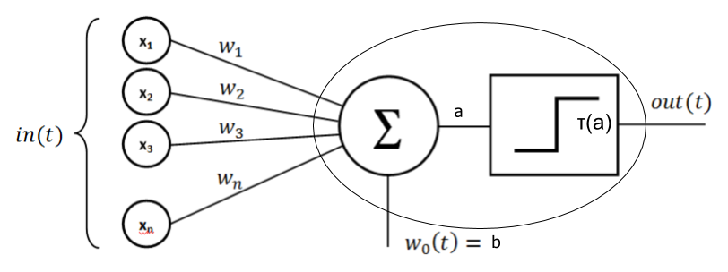

# Multilayer Perceptron (MLP)

A multilayer perceptron (MLP) is a class of feed-forward artificial neural network(NN). A MLP consists of, at least, three layers of nodes: an input layer, a hidden layer and an output layer. Except for the input nodes, each node is a neuron that uses a nonlinear activation function(Wikipedia).
In this repository, I present the mathematical formulation and implementation in Python of a MLP. I also train e validate the algorithm against three different data sets, presenting pratical examples of how to use MLP to classify data.

# Preamble 

You may be asking yourself: why do we need another MLP explanation in the internet? This repository  provides my thought process after reading several materials when I tried to implement a MLP by myself. At the time, I could understand and implement it only after a lot of reading, and trial and error. So, as I felt the necessity to read different points of views and be exposed to different ways of explaining the same topic, I think others may face the same situation.

Hope this document can help you on your learning journey. Good Luck !

# Mathematical Formulation

MLP is a biologic inspired algorithm that mimics biologic neural networks. However, instead of real neurons and synapses, MLPs are composed by mathematical neurons, and synapses, in this case called weights. Neurons are arranged in layers, and connected between them through weights. The simplest MLP you can build is composed of three layers: Input, Hidden and Output layers. In the classical topology each neuron of a given layer is fully connected with the neurons of the next layer.

Mathematically speaking, a neuron output is given by by:

\begin{equation}
    $\tau( $\sum_{i=1}_{n} w_{i}*x_{i}$ + b )$
\end{equation}

# Topology 

We'll start formulating a MLP with the following topology: 2-2-1
* 2 Input Layer Neurons
* 2 Hidden Layer neurons
* 1 Output Layer Neuron

Then we'll generalize this particular case to have a general formulation for a general topology.

# Implementation

# Training and Validating

# Example MLP Library usage

## XOR Gate

## Iris UCI

## MNNIST